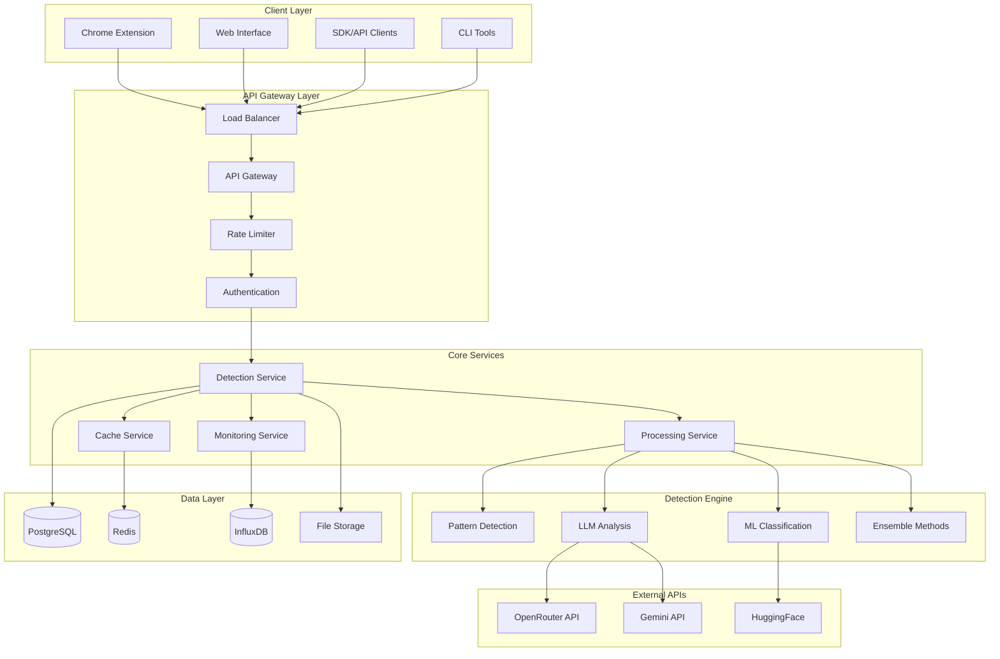
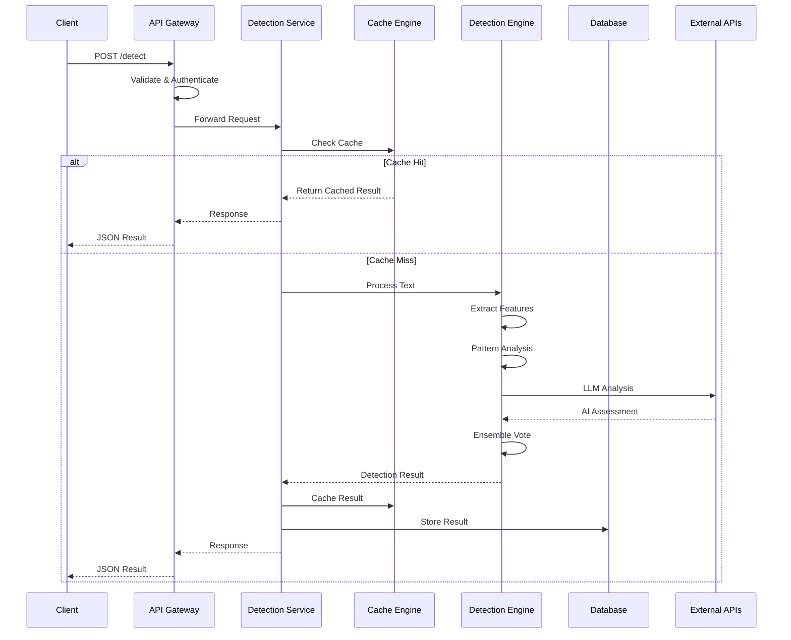
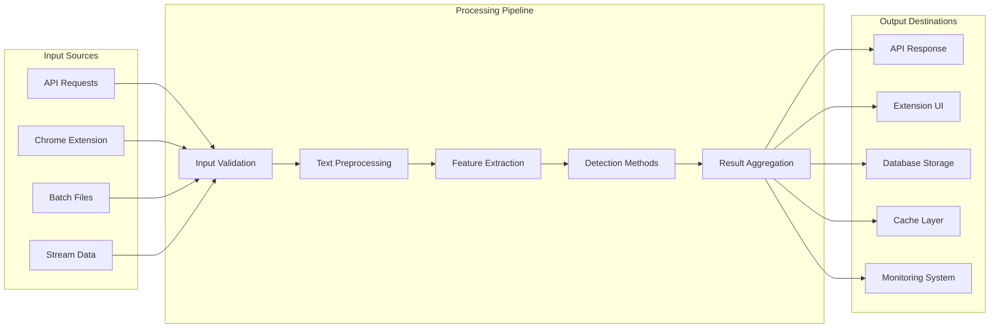
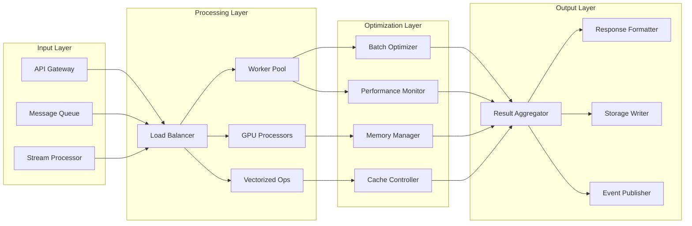
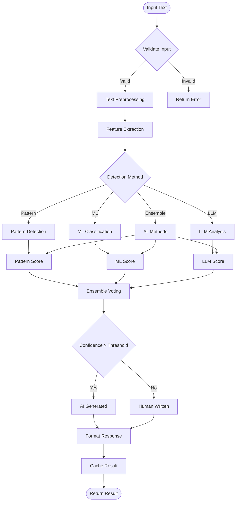
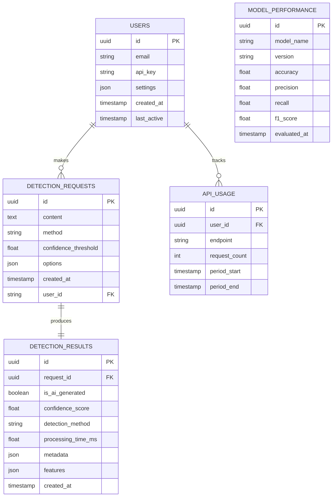
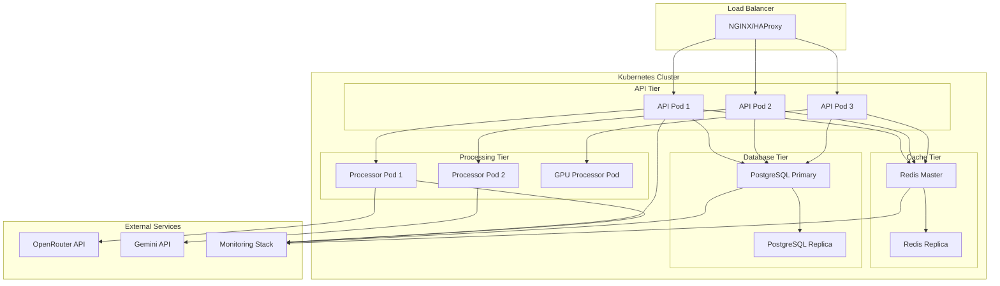
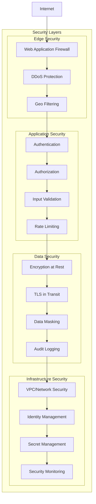
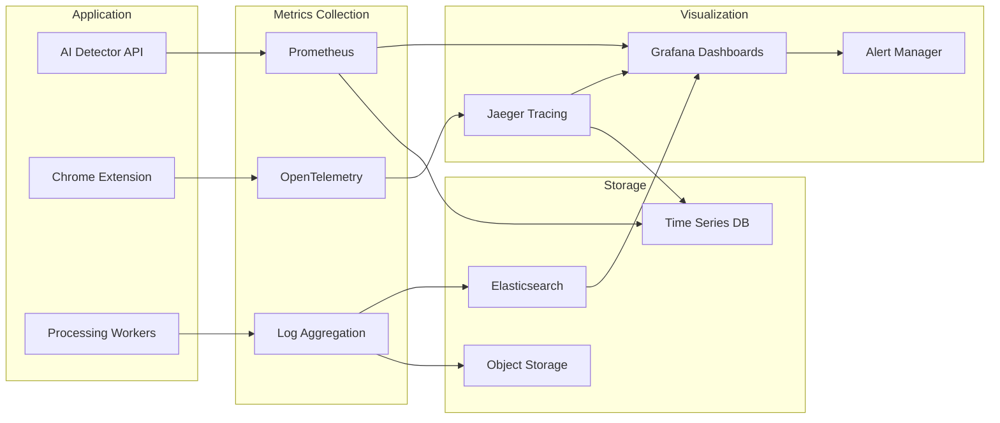
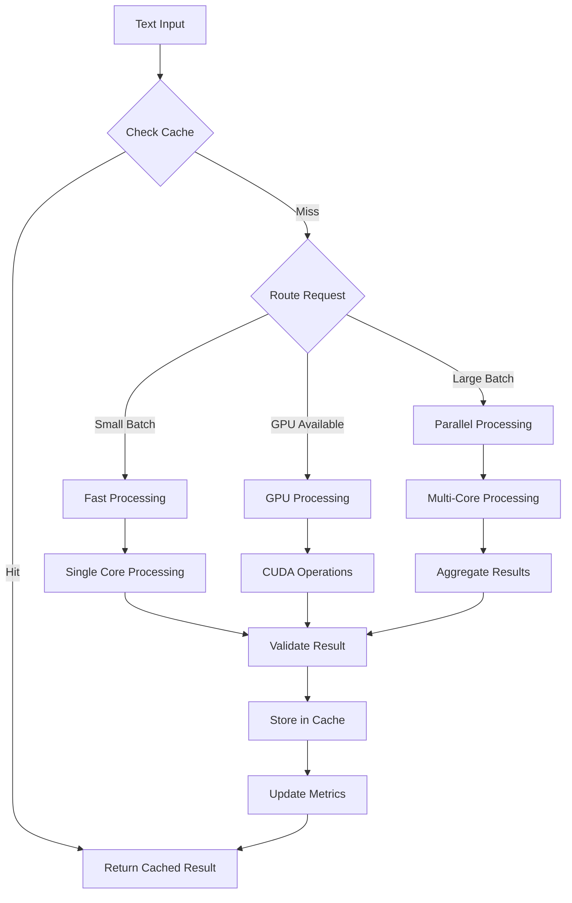

# System Overview Diagrams

Visual representations of the AI Detector system architecture using ASCII diagrams and Mermaid charts for comprehensive system understanding.

## High-Level System Architecture



## Component Interaction Flow



## Data Flow Architecture



## Chrome Extension Architecture

```mermaid
graph TB
    subgraph "Extension Components"
        popup[Popup UI]
        background[Background Script]
        content[Content Script]
        options[Options Page]
    end
    
    subgraph "Chrome APIs"
        storage[chrome.storage]
        runtime[chrome.runtime]
        tabs[chrome.tabs]
        scripting[chrome.scripting]
    end
    
    subgraph "Web Page"
        dom[DOM Elements]
        text[Text Content]
        indicators[Visual Indicators]
    end
    
    subgraph "AI Detector API"
        detect[/detect]
        batch[/detect/batch]
        health[/health]
    end
    
    popup <--> background
    content <--> background
    options <--> background
    
    background <--> storage
    background <--> runtime
    background <--> tabs
    background <--> scripting
    
    content <--> dom
    content <--> text
    content <--> indicators
    
    background <--> detect
    background <--> batch
    background <--> health
```

## High-Throughput Processing Architecture



## Detection Engine Workflow



## Database Schema Design



## Deployment Architecture



## Security Architecture



## Monitoring and Observability



## Performance Optimization Flow



These diagrams provide a comprehensive visual representation of the AI Detector system architecture, showing how components interact, data flows through the system, and how different architectural patterns are implemented for scalability, security, and performance.

---

*Last updated: January 15, 2025*